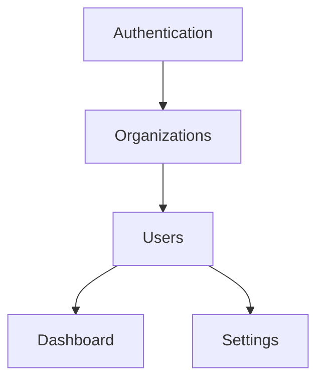

# Project Activation Guide

**Activate Claude Code optimization for a specific project (10-15 minutes)**

This guide walks you through activating the global Claude Code optimization system for a specific project. After completing the global setup (see `../01-global-optimization/`), each project requires a brief activation process to create project-specific memories and configuration.

---

## Table of Contents

1. [Prerequisites](#prerequisites)
2. [Overview](#overview)
3. [Quick Start](#quick-start)
4. [Step-by-Step Activation](#step-by-step-activation)
5. [Memory Creation](#memory-creation)
6. [Constitution Setup](#constitution-setup)
7. [Verification](#verification)
8. [Troubleshooting](#troubleshooting)
9. [Next Steps](#next-steps)

---

## Prerequisites

Before activating a project, ensure:

- ✅ Global optimization setup complete (`~/.claude/` configured)
- ✅ Serena MCP server available (check with Claude Code)
- ✅ You're in your project's root directory
- ✅ Project has recognizable structure (code files, config files)

**Check global setup**:
```bash
ls ~/.claude/agents/pm-orchestrator.md
ls ~/.claude/skills/*/SKILL.md
# Should see optimize, context, cache-inspector, update-docs, init-project
```

**Check Serena availability**:
In Claude Code conversation, try reading a file symbolically. If Serena is not activated, you'll see "No active project" errors.

---

## Overview

### What Project Activation Does

**Creates project-specific memories** (`.serena/memories/`):
- `architecture.md` - Project structure, patterns, key modules
- `codebase-conventions.md` - Coding standards, naming patterns
- `module-structure.md` - Directory map, module relationships (if applicable)
- `testing-strategy.md` - Test patterns, commands, conventions
- `docker-workflow.md` - Docker commands, container names (if applicable)

**Optional configuration** (`.claude/settings/`):
- `constitution.json` - Architectural decision framework (if needed)

**Token savings**:
- **Per session**: 60-70% reduction (load 5-8K token memories vs reading 15-20K tokens from files)
- **Long-term**: 70-90% with prompt caching on repeated memory reads

### Time Investment

- **Automated** (using `/init-project --full`): 10-15 minutes
- **Manual** (following this guide): 20-30 minutes
- **Per project**: One-time activation
- **ROI**: Immediate - first session benefits from optimizations

---

## Quick Start

### Option 1: Automated (Recommended)

```bash
# Navigate to project root
cd ~/projects/your-project

# Run automated initialization
# In Claude Code conversation:
/init-project --full
```

This will:
1. Auto-detect your language/framework
2. Activate Serena for the project
3. Fetch best practices from fastmcp.me
4. Create constitution.json
5. Initialize all 5 memories with templates
6. Configure optimization settings

**Time**: 10-15 minutes (mostly automated)

### Option 2: Semi-Automated (Agent)

```bash
# Navigate to project root
cd ~/projects/your-project

# Copy activation-agent.md content
# Paste into Claude Code conversation
# Agent guides you through activation
```

**Time**: 15-20 minutes (guided)

### Option 3: Manual (This Guide)

Follow the step-by-step instructions below.

**Time**: 20-30 minutes (full control)

---

## Step-by-Step Activation

### Step 1: Activate Serena

Serena needs to know about your project before it can create memories.

**Method 1: Using mcp__serena__activate_project**

In Claude Code conversation:
```
Please activate Serena for this project.
Use the tool: mcp__serena__activate_project
Project path: /full/path/to/your/project
```

Claude will call the tool and confirm activation.

**Method 2: Using /init-project command**

```
/init-project detect
```

This auto-detects your project and activates Serena.

**Verification**:
```
Please check if Serena is activated.
Try: mcp__serena__get_current_config
```

You should see your project listed as the active project.

---

### Step 2: Run Onboarding (If First Time)

If you haven't run Serena onboarding yet for this project:

**In Claude Code conversation**:
```
Please run Serena onboarding for this project.
Use: mcp__serena__onboarding
```

Serena will:
- Analyze your project structure
- Identify language and frameworks
- Recommend memory files to create
- Suggest constitution rules

**Important**: This is a one-time setup per project.

---

### Step 3: Create Core Memories

Serena stores project knowledge in `.serena/memories/` as Markdown files. These are loaded at session start, providing instant context without reading files.

**Create 5 core memories**:

#### 3.1 Architecture Memory

**File**: `.serena/memories/architecture.md`

**Purpose**: High-level project structure, key patterns, module organization

**Template**:
```markdown
# Project Architecture

## Project Type
[e.g., Multi-tenant Laravel SaaS, React SPA, Python/Django API, Rust microservice]

## Tech Stack
- **Language**: [PHP 8.3, JavaScript ES6, Python 3.11, Rust 1.75, etc.]
- **Framework**: [Laravel 11, React 18, Django 5, Actix-web, etc.]
- **Database**: [PostgreSQL, MySQL, MongoDB, etc.]
- **Cache**: [Redis, Memcached, etc.]
- **Queue**: [Redis, RabbitMQ, etc.]

## Directory Structure
```
project-root/
├── app/               # [Application code, models, controllers]
├── resources/         # [Views, assets]
├── database/          # [Migrations, factories, seeders]
├── tests/             # [Test files]
├── config/            # [Configuration files]
└── docker/            # [Docker configuration]
```

## Key Architectural Patterns

### [Pattern 1: e.g., Multi-Tenancy]
- **Implementation**: [Organization-scoped queries, UUID primary keys]
- **Critical Files**: [Models, Middleware, Service classes]
- **Rules**: [ALWAYS scope by organization_id, never expose sequential IDs]

### [Pattern 2: e.g., Service Layer]
- **Implementation**: [Business logic in Services, controllers stay thin]
- **Location**: [app/Services/]
- **Usage**: [Called from controllers, contains all business rules]

## Module Structure
[List main modules/features and their relationships]

## External Integrations
[APIs, webhooks, third-party services]
```

**How to fill it**:
1. Start with basic info (language, framework)
2. Add directory structure (use `ls -la` or file tree)
3. Identify 2-3 key patterns (multi-tenancy, auth, caching, etc.)
4. List main modules/features
5. Note any unique architectural decisions

**Token size**: 5-8K tokens (comprehensive but concise)

---

#### 3.2 Codebase Conventions Memory

**File**: `.serena/memories/codebase-conventions.md`

**Purpose**: Coding standards, naming patterns, file organization rules

**Template**:
```markdown
# Codebase Conventions

## Code Quality Standards

### Validation
- **Rule**: [e.g., ALL validation uses FormRequest classes (never inline)]
- **Location**: [app/Http/Requests/]
- **Pattern**: [One FormRequest per form, named {Action}{Model}Request]

### Business Logic
- **Rule**: [e.g., Business logic in Service Layer]
- **Location**: [app/Services/]
- **Pattern**: [One service per domain, injected via constructor]

### Authorization
- **Rule**: [e.g., Use Policy classes for all authorization]
- **Location**: [app/Policies/]
- **Pattern**: [One policy per model, registered in AuthServiceProvider]

## Naming Conventions

### Files
- **Models**: [PascalCase, singular (User.php)]
- **Controllers**: [PascalCase, plural + Controller (UsersController.php)]
- **Services**: [PascalCase + Service (UserService.php)]
- **Policies**: [PascalCase + Policy (UserPolicy.php)]

### Database
- **Tables**: [snake_case, plural (users, organization_users)]
- **Columns**: [snake_case (first_name, created_at)]
- **Foreign Keys**: [{model}_id (user_id, organization_id)]
- **Pivot Tables**: [alphabetical order (organization_user, not user_organization)]

### Routes
- **Naming**: [snake_case (api/users/profile, not api/users/userProfile)]
- **Grouping**: [By module/feature]

## File Organization

### Where to Put New Code
- **New Model**: [app/Models/]
- **New Controller**: [app/Http/Controllers/{Module}/]
- **New Service**: [app/Services/{Module}/]
- **New Request**: [app/Http/Requests/{Module}/]
- **New Policy**: [app/Policies/]
- **New Migration**: [database/migrations/]
- **New Test**: [tests/Feature/{Module}/ or tests/Unit/]

## Common Patterns

### Eloquent Relationships
```php
// Always define inverse relationships
// Use proper return types
public function organization(): BelongsTo
{
    return $this->belongsTo(Organization::class);
}
```

### Service Layer Pattern
```php
// Controllers call services, services contain business logic
public function store(CreateUserRequest $request)
{
    $user = $this->userService->create($request->validated());
    return response()->json($user, 201);
}
```

### Query Scoping (Multi-Tenancy)
```php
// ALWAYS scope by organization
User::where('organization_id', auth()->user()->organization_id)->get();
```

## Anti-Patterns (DON'T)

- ❌ Inline validation in controllers
- ❌ Business logic in controllers or models
- ❌ Direct authorization checks (use policies)
- ❌ Queries without organization scoping
- ❌ Sequential IDs in URLs (use UUIDs)
```

**How to fill it**:
1. Document validation approach
2. Note where business logic lives
3. List naming conventions for all file types
4. Show common code patterns with examples
5. List anti-patterns to avoid

**Token size**: 3-5K tokens

---

#### 3.3 Module Structure Memory (If Applicable)

**File**: `.serena/memories/module-structure.md`

**Purpose**: Map of modules/features, their relationships, navigation guide

**When to create**: If your project has multiple distinct modules/features

**Template**:
```markdown
# Module Structure

## Module Overview

Total modules: [21]

### Core Modules
1. **Authentication** - User login, registration, password reset
2. **Organizations** - Multi-tenant organization management
3. **Users** - User profiles, permissions, roles

### Feature Modules
4. **Dashboard** - Analytics, charts, summaries
5. **Settings** - Application configuration
[... list all modules ...]

## Module Dependencies



## Module Structure Template

Each module follows this structure:
```
app/
├── Http/Controllers/{Module}/
│   ├── {Module}Controller.php
│   └── {Action}Controller.php
├── Models/{Module}/
│   └── {Model}.php
├── Services/{Module}/
│   └── {Module}Service.php
resources/views/{module}/
│   ├── index.blade.php
│   ├── show.blade.php
│   ├── create.blade.php
│   └── edit.blade.php
tests/Feature/{Module}/
│   └── {Module}Test.php
```

## Module-Specific Notes

### Module: Organizations
- **Routes**: `/organizations/*`
- **Key Models**: Organization, OrganizationUser
- **Key Services**: OrganizationService
- **Special Logic**: Multi-tenancy scoping, plan tier gating

### Module: Users
- **Routes**: `/users/*`
- **Key Models**: User, Role, Permission
- **Key Services**: UserService, RoleService
- **Special Logic**: RBAC, organization scoping
[... document each module ...]

## Finding Code by Feature

- **User authentication**: app/Http/Controllers/Auth/
- **Organization switching**: app/Services/OrganizationService.php
- **Dashboard widgets**: app/View/Components/Dashboard/
[... map features to locations ...]
```

**How to fill it**:
1. List all modules/features
2. Show dependency relationships
3. Document standard module structure
4. Note special logic per module
5. Create feature → code location map

**Token size**: 2-3K tokens

**Skip if**: Single-module or very small project

---

#### 3.4 Testing Strategy Memory

**File**: `.serena/memories/testing-strategy.md`

**Purpose**: How to run tests, write tests, test patterns and conventions

**Template**:
```markdown
# Testing Strategy

## Running Tests

### Full Test Suite
```bash
# [Your test command, e.g.:]
docker-compose exec app php artisan test
# or
npm test
# or
cargo test
```

### Specific Test File
```bash
# [e.g.:]
docker-compose exec app php artisan test --filter=UserTest
npm test UserService.test.js
cargo test user_service
```

### With Coverage
```bash
# [e.g.:]
docker-compose exec app php artisan test --coverage
npm test -- --coverage
cargo tarpaulin
```

## Test Organization

### Directory Structure
```
tests/
├── Feature/           # [Integration tests, HTTP tests]
│   ├── Auth/
│   ├── Organizations/
│   └── Users/
├── Unit/              # [Unit tests, isolated logic]
│   ├── Services/
│   └── Models/
└── Fixtures/          # [Test data, mocks]
```

### Naming Conventions
- **File**: [{Thing}Test.php or {thing}.test.js]
- **Class**: [{Thing}Test extends TestCase]
- **Method**: [test_{action}_{expected_outcome}()]

## Test Patterns

### Feature Test Pattern (HTTP)
```php
// [Example: Testing HTTP endpoint]
public function test_user_can_create_organization()
{
    $user = User::factory()->create();

    $response = $this->actingAs($user)->postJson('/api/organizations', [
        'name' => 'Acme Corp',
        'plan' => 'premium',
    ]);

    $response->assertStatus(201);
    $this->assertDatabaseHas('organizations', ['name' => 'Acme Corp']);
}
```

### Unit Test Pattern (Service)
```php
// [Example: Testing service method]
public function test_user_service_creates_user_with_organization()
{
    $organization = Organization::factory()->create();

    $user = $this->userService->create([
        'name' => 'John Doe',
        'email' => 'john@example.com',
        'organization_id' => $organization->id,
    ]);

    $this->assertInstanceOf(User::class, $user);
    $this->assertEquals($organization->id, $user->organization_id);
}
```

## Factory Patterns

### Basic Factory
```php
// [e.g., UserFactory.php]
public function definition()
{
    return [
        'name' => $this->faker->name(),
        'email' => $this->faker->unique()->safeEmail(),
        'organization_id' => Organization::factory(),
    ];
}
```

### Factory States
```php
// [e.g., different user types]
public function admin()
{
    return $this->state(['role' => 'admin']);
}

public function suspended()
{
    return $this->state(['status' => 'suspended']);
}
```

## Test Database

### Configuration
- **Driver**: [SQLite in-memory for tests]
- **Config File**: [phpunit.xml, jest.config.js, etc.]
- **Migrations**: [Run automatically before each test]

### Seeding
```php
// [When to seed vs factory]
// Use factories for specific test data
// Use seeders for baseline data needed by all tests
```

## Debugging Failed Tests

### 5-Iteration Rule
1. **Run test** - See the error
2. **Add debugging** - dd(), console.log(), dbg!
3. **Check state** - Database, session, cache
4. **Fix code** - Make the change
5. **Verify** - Test passes

If not fixed after 5 iterations, ask for help or review approach.

## Coverage Targets

- **Overall**: [80%+ code coverage]
- **Critical paths**: [100% (auth, payments, security)]
- **Services**: [90%+]
- **Controllers**: [80%+]
- **Models**: [70%+ (basic relationships)]

## Common Test Utilities

### Authentication Helper
```php
protected function actAsUser($role = 'user')
{
    $user = User::factory()->$role()->create();
    return $this->actingAs($user);
}
```

### Assertion Helpers
[Document custom assertions, if any]
```

**How to fill it**:
1. Document test commands (local, Docker, CI)
2. Show test file organization
3. Provide pattern examples for feature/unit tests
4. Document factory patterns
5. Note test database configuration
6. List debugging strategies

**Token size**: 2-3K tokens

---

#### 3.5 Docker Workflow Memory (If Applicable)

**File**: `.serena/memories/docker-workflow.md`

**Purpose**: Docker commands, container names, common workflows

**When to create**: If project uses Docker

**Template**:
```markdown
# Docker Workflow

## Container Names

- **App**: [app] - Main application container
- **Database**: [db] - PostgreSQL/MySQL container
- **Redis**: [redis] - Cache/queue container
- **Web Server**: [nginx] - Nginx container (if separate)
- **Worker**: [worker] - Queue worker container (if applicable)

## Common Commands

### Start/Stop
```bash
# Start all containers
docker-compose up -d

# Stop all containers
docker-compose down

# Restart specific container
docker-compose restart app
```

### Execute Commands in Containers
```bash
# ALL artisan commands must use docker-compose exec
docker-compose exec app php artisan migrate
docker-compose exec app php artisan make:model Product
docker-compose exec app php artisan test

# Composer commands
docker-compose exec app composer install
docker-compose exec app composer require package/name

# NPM commands
docker-compose exec app npm install
docker-compose exec app npm run build
```

### Database
```bash
# Run migrations
docker-compose exec app php artisan migrate

# Fresh migrations with seeding
docker-compose exec app php artisan migrate:fresh --seed

# Access database CLI
docker-compose exec db psql -U [username] -d [database]
```

### Logs
```bash
# View all logs
docker-compose logs -f

# View specific container logs
docker-compose logs -f app
docker-compose logs -f db
```

### Shell Access
```bash
# Enter app container
docker-compose exec app bash

# Enter database container
docker-compose exec db bash
```

## Development Workflow

### After Git Pull
```bash
docker-compose exec app composer install
docker-compose exec app php artisan migrate
docker-compose exec app npm install
docker-compose exec app npm run build
```

### Making Database Changes
```bash
# Create migration
docker-compose exec app php artisan make:migration create_products_table

# Edit migration file
# Run migration
docker-compose exec app php artisan migrate
```

### Running Tests
```bash
# Full test suite
docker-compose exec app php artisan test

# Specific test
docker-compose exec app php artisan test --filter=UserTest

# With coverage
docker-compose exec app php artisan test --coverage
```

## Environment Files

- **`.env`** - Main environment configuration
- **`.env.testing`** - Test environment (if separate)
- **`docker-compose.yml`** - Docker configuration

## Debugging

### Container Issues
```bash
# Check container status
docker-compose ps

# View container logs
docker-compose logs app

# Restart problematic container
docker-compose restart app
```

### Database Connection Issues
```bash
# Check database is running
docker-compose ps db

# Verify .env DB_HOST matches container name
# (Usually DB_HOST=db, not localhost)
```

### Permission Issues
```bash
# Fix storage permissions
docker-compose exec app chmod -R 775 storage bootstrap/cache
docker-compose exec app chown -R www-data:www-data storage bootstrap/cache
```

## CRITICAL RULES

1. ✅ **ALWAYS use `docker-compose exec app`** for artisan, composer, npm commands
2. ✅ **NEVER run commands directly on host** (they won't affect Docker environment)
3. ✅ **Use container names in .env** (DB_HOST=db, not localhost)
4. ✅ **Check docker-compose.yml** for accurate container names
```

**How to fill it**:
1. List all container names from docker-compose.yml
2. Document standard command patterns
3. Show development workflow steps
4. Note common debugging scenarios
5. Highlight critical rules (exec vs direct commands)

**Token size**: 1-2K tokens

**Skip if**: No Docker usage

---

### Step 4: Save Memories to Serena

After creating the memory files, save them using Serena:

**In Claude Code conversation**:
```
Please save these memories to Serena:
- .serena/memories/architecture.md
- .serena/memories/codebase-conventions.md
- .serena/memories/module-structure.md (if created)
- .serena/memories/testing-strategy.md
- .serena/memories/docker-workflow.md (if created)

Use: mcp__serena__write_memory for each file
```

**Verify memories saved**:
```
List all memories:
mcp__serena__list_memories
```

You should see all your memory files listed.

---

## Constitution Setup

**Optional**: Create a constitution if your project has critical architectural rules that must be enforced.

### When to Create a Constitution

Create `.claude/settings/constitution.json` if:
- Multi-tenant architecture (critical scoping rules)
- Strict security requirements
- Complex architectural patterns
- Team needs consistent decision-making framework

### Constitution Template

**File**: `.claude/settings/constitution.json`

```json
{
  "version": "1.0.0",
  "project": "Your Project Name",
  "description": "Architectural decision framework for this project",

  "principles": {
    "multi_tenancy": {
      "priority": "critical",
      "description": "All data must be scoped to organizations",
      "rules": [
        "ALWAYS scope queries by organization_id",
        "Use UUID primary keys for all models",
        "Never expose sequential IDs in URLs or APIs",
        "Validate organization access in all policies"
      ],
      "enforcement": "automatic",
      "violations": "reject_change"
    },

    "code_quality": {
      "priority": "high",
      "description": "Maintain consistent code quality standards",
      "rules": [
        "FormRequest for ALL validation (never inline)",
        "Service Layer for business logic",
        "Policy classes for authorization",
        "Factory classes for all models"
      ],
      "enforcement": "automatic",
      "violations": "warn_and_suggest_fix"
    },

    "testing": {
      "priority": "high",
      "description": "All changes must include tests",
      "rules": [
        "Feature tests for all HTTP endpoints",
        "Unit tests for all service methods",
        "Factory coverage for all models",
        "Run tests before committing"
      ],
      "enforcement": "automatic",
      "violations": "warn_and_suggest_fix"
    },

    "docker_workflow": {
      "priority": "critical",
      "description": "All commands must use Docker",
      "rules": [
        "ALL artisan commands via 'docker-compose exec app'",
        "ALL composer commands via 'docker-compose exec app'",
        "NEVER run commands directly on host"
      ],
      "enforcement": "automatic",
      "violations": "reject_change"
    }
  },

  "decision_framework": {
    "new_feature": [
      "Check if similar feature exists",
      "Verify multi-tenancy scoping",
      "Plan tests before implementation",
      "Create FormRequest for validation",
      "Create Service for business logic",
      "Create Policy if authorization needed"
    ],

    "bug_fix": [
      "Identify root cause",
      "Write failing test first",
      "Fix the bug",
      "Verify test passes",
      "Check for similar bugs elsewhere"
    ],

    "refactoring": [
      "Ensure tests exist and pass",
      "Make incremental changes",
      "Run tests after each change",
      "Verify no behavior changes"
    ]
  }
}
```

**How to customize**:
1. Replace "Your Project Name" with actual project name
2. Adjust priorities (critical, high, medium, low)
3. Add/remove principles based on your architecture
4. Define decision frameworks for common scenarios
5. Set enforcement levels (automatic, manual, advisory)

**Token impact**: Constitution adds ~2K tokens to session start but prevents costly mistakes

---

## Verification

After activation, verify everything works:

### 1. Check Serena Activation

```
In Claude Code:
Please check Serena status:
mcp__serena__get_current_config
```

Should show your project as active.

### 2. List Memories

```
List all memories:
mcp__serena__list_memories
```

Should see all 5 (or 3-4) memory files.

### 3. Read a Memory

```
Read architecture memory:
mcp__serena__read_memory
memory_file_name: architecture.md
```

Should return your architecture content.

### 4. Test Symbol-First Exploration

```
Find a class in your project using symbols:
mcp__serena__find_symbol
name_path_pattern: YourClassName
```

Should find the class without reading the full file.

### 5. Test with Simple Task

```
/optimize "Fix typo in README.md"
```

Watch for:
- PM Orchestrator loads memories
- Uses symbol-first exploration
- References constitution (if applicable)
- Completes task efficiently

---

## Troubleshooting

### "No active project" Error

**Symptom**: Serena tools fail with "No active project"

**Fix**:
```
Activate the project:
mcp__serena__activate_project
project: /full/path/to/your/project
```

### Memories Not Loading

**Symptom**: Session doesn't include project context

**Fix**:
1. Verify memories exist:
   ```bash
   ls .serena/memories/
   ```

2. List memories in Serena:
   ```
   mcp__serena__list_memories
   ```

3. If missing, recreate them following Step 3 above

### Symbol-First Not Working

**Symptom**: Claude reads full files instead of using symbols

**Fix**:
1. Check Serena is activated (see above)
2. Verify language server is running for your language
3. Check `.serena/project.yml` has correct language configuration
4. Remind Claude to use symbol-first exploration:
   ```
   Please use symbol-first exploration.
   Use mcp__serena__find_symbol before reading files.
   ```

### Constitution Not Enforced

**Symptom**: Architectural rules not followed

**Fix**:
1. Verify constitution.json exists:
   ```bash
   ls .claude/settings/constitution.json
   ```

2. Validate JSON syntax:
   ```bash
   cat .claude/settings/constitution.json | python -m json.tool
   ```

3. Check PM Orchestrator is loading it:
   ```
   Please check if constitution is loaded.
   Read: .claude/settings/constitution.json
   ```

### Low Token Savings

**Symptom**: Not seeing 60-70% token reduction

**Possible causes**:
1. **Memories not loaded** - Verify memories are being loaded at session start
2. **Reading full files** - Ensure symbol-first exploration is used
3. **No prompt caching** - Check if prompt caching is enabled in global settings
4. **Small project** - Savings more noticeable in larger projects

**Debug**:
```
/cache-inspector status
```

Check cache hit rate and memory usage.

---

## Next Steps

After successful activation:

### 1. Start Using Optimized Workflows

```bash
# For any task
/optimize "Your task here"

# For implementing a feature
/sc-implement "New feature description"

# For working on specific module
/sc-module module-name
```

### 2. Monitor Token Savings

```bash
# Check cache performance
/cache-inspector status

# Analyze token usage
/cache-inspector analyze
```

### 3. Update Memories as Project Evolves

When architecture changes:
```bash
# Refresh memories
/context refresh

# Or manually update specific memory
# Edit .serena/memories/architecture.md
# Re-save with mcp__serena__write_memory
```

### 4. Share Activation with Team

Share this guide and memory templates with teammates:
```bash
# Zip memory files as examples
tar -czf memories-template.tar.gz .serena/memories/

# Share with team
# They can use as starting point for their activation
```

### 5. Activate Additional Projects

For your next project:
```bash
cd ~/projects/another-project
/init-project --full
```

With global setup complete, each new project takes only 10-15 minutes!

---

## Summary

**What we accomplished**:
- ✅ Activated Serena for your project
- ✅ Created 3-5 core memories (12-20K tokens of context)
- ✅ Optionally created constitution for architectural decisions
- ✅ Verified activation successful
- ✅ Ready for 60-90% token savings on all future sessions

**Time invested**: 10-30 minutes (depending on automation level)

**Expected savings**:
- **Per session**: 60-70% token reduction (load memories vs read files)
- **With caching**: 70-90% total reduction
- **Cost savings**: $1-2 per session for medium/large projects
- **Speed improvement**: 40-50% faster (less file reading)

**ROI**: Immediate - first session benefits from optimizations

---

**Next**: Start working with optimized workflows! See `../03-custom-skills/` for creating project-specific skills, or jump straight to coding with `/optimize "your task"`.
